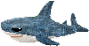

# Shapes in Space

A simple 2D top-down space shooter game, with many enemies and bosses. Programmed entirely by myself. Art and music were done by friends. Only dependency is Java 17 (duh) and Raylib (jaylib). This game was made as a final project for my AP Computer Science course.

## Running
Create a folder at the root of the project named `test`
Then run the following scripts
```console
$ python3 copyJaylib.py
$ python3 copyResources.py
$ python3 compile.py
```

Running `compile.py` will launch the game. Why didn't I use a build system? I don't know.

## Notice
When starting this project, this game was going to be a 'quick thing' so a lot of code I wrote early on was messy, not expecting to use it too much. That was a mistake. <br>
There are plenty of bugs in this game, but that's OK, it was all just a learning experience anyway. <br>
I wish I had spent more time in this project since there were plenty of features I wish I had added. <br>
Also there is very little organization in the codebase.

## How to Play
### Movement
| Key | Action   |
|-----|----------|
| W   | Up       |
| A   | Left     |
| S   | Down     |
| D   | Right    |

### Attacking
**Left click** to toggle shooting. Bullets fly from the player (the green square) to your mouse.

### Powerups
Defeating bosses grants you a Powerup. You can select one of three. Selecting a powerup you already own will level up that powerup.
See list of powerups later in the README.

## Screenshots


## Friendlies
| Entity | Description | Sprite |
|--------|---------|--------|
| Spirit | Touch to select a powerup |  |
| Blahaj | Will deal moderate damage and apply moderate healing |  |
| Squiggy | Deals large amounts of damage |  |
| Fluffy | Protects you from incoming damage and grants light healing | 


## Enemies (Bosses are bolded)
| Entity | Description |
|--------|-------------|
| Square | Shoots bullets at you |
| Circle | Flies by you and will release a 'pulse' of bullets |
| Triangle | Quickly moves to a nearby position and will fire a laser at you |
| Sigma | Starts slow, but will quickly gain a lot of speed. Will explode on contact. |
| **Hexagon Worm** | Large enemy made up of multiple segments. Headshots deal double damage. Shoots 'Hexa-Bombs'. |
| **Cube** | A 3D Cube? In a 2D game? I wish I made this boss more interesting though. Blue phase converts incoming damage into healing. Will also summon many 'Sigmas' |
| **The Rubin X** | An X made up of Xs. Consist of two phases. Very chaotic |
| **The Final Fractal** | Final boss. It will throw everything at you. |

## Powerup list
| Powerup | Description |
|---------|-------------|
| Absorption | Reduces incoming damage by a percentage. |
| Blahaj  | Summons a friendly shark to help you in battle. See the Friendlies table earlier in the README. |
| Dash | Allows you to quickly move and avoid attacks. Press SPACE to use. |
| Decay | Divides incoming damage and applies it over time. |
| D'amico Diamond | Percentage chance to quadruple your damage on an enemy, will also provide healing on successful attacks. |
| Fluffy | Summons a space sheep to aid you in your defenses. |
| Health Regen | Health regeneration over time. |
| Health Syphon | Steals health from nearby enemies. |
| Richmond Rhombus | Grants you 'artificial' health. As long as you have at least 1 AHP, it will absorb all incoming damage. |
| Squiggy | A friendly octopus to aid you in your battles. |

## Final comments
Total of 9,198 lines of java code. (Pretty small!)
Tested on Windows and Linux. (Though it probably works on MacOS too)